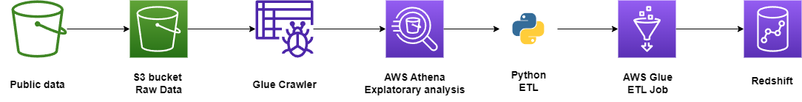

# COVID Data Engineering Project

This project focuses on utilizing publicly available COVID-19 data to perform data engineering tasks, including data extraction, transformation, loading, and analysis. The project leverages various AWS services to create a dimensional model of the COVID data, facilitating exploratory analysis.

## Table of Contents

- [Introduction](#introduction)
- [Features](#features)
- [Data](#data)
- [Workflow](#workflow)
  - [Data Ingestion](#data-ingestion)
  - [Data Transformation](#data-transformation)
  - [Dimensional Modeling](#dimensional-modeling)
  - [Data Warehousing](#data-warehousing)

## Introduction

This project aims to demonstrate a data engineering pipeline for processing COVID-19-related data from various public sources. It showcases how to extract raw data, transform it into a meaningful dimensional model, and store it in a data warehousing solution for further analysis.

## Features

- Data extraction and ingestion from public AWS datasets.
- Data transformation using AWS Glue and Python pandas.
- Creation of a dimensional model comprising a fact table and multiple dimension tables.
- Loading dimensional data into AWS Redshift for analysis.

## Data

The data for this project is taken from the [AWS COVID-19 data lake](https://aws.amazon.com/blogs/big-data/a-public-data-lake-for-analysis-of-covid-19-data/), a centralized repository of up-to-date and curated datasets related to the spread and characteristics of COVID-19. This data lake is hosted on the AWS cloud and includes COVID-19 case tracking data, hospital bed availability, and research articles about COVID-19 and related coronaviruses.

## Workflow

### Data Ingestion

1. Public COVID-19-related data in CSV format is obtained from AWS datasets and stored in an S3 bucket.
2. AWS Glue Crawler is employed to create a schema for the raw data, making it queryable using AWS Athena.

### Data Transformation

1. Python scripts utilizing the pandas library are developed to perform data extraction, transformation, and loading (ETL) tasks.
2. ETL scripts read the raw COVID data from the S3 bucket, transform it, and create a dimensional model.
3. The dimensional model consists of one fact table, "factCovid," and three dimension tables, "dimRegion," "dimHospital," and "dimDate."
4. Transformed dimensional data is saved back to the S3 bucket for further processing.

### Dimensional Modeling

1. The "factCovid" table contains COVID-19-related statistics and references to dimension keys.
2. Dimension tables provide additional information, including geographical regions ("dimRegion"), hospitals ("dimHospital"), and dates ("dimDate").
3. These dimension tables enhance data integrity and allow for efficient analysis using data warehousing techniques.

### Data Warehousing

1. AWS Glue Jobs are used to orchestrate the creation of the dimensional model within AWS Redshift, a data warehousing solution.
2. Data from the S3 bucket is copied into AWS Redshift, aligning with the defined dimensional structure.
3. The dimensional model in AWS Redshift is now ready for querying and analysis.

